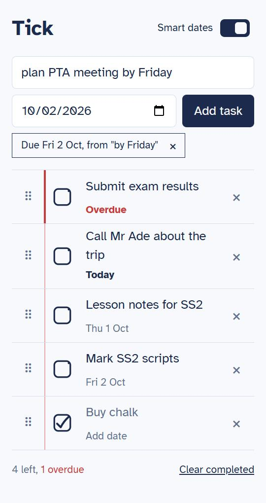

# Tick

Tick is a small to-do list web app. You can add, tick off, edit, delete and
drag tasks into order, and give any task a due date. Its extra feature is
**Smart dates**: type "grade SS2 scripts by Friday" and Tick finds the date,
shows it to you before saving, and saves the task as "grade SS2 scripts" due on
Friday.

Built for HNG Internship 15, Stage One.

- **Live app:** https://todo-inky-one-57.vercel.app
- **Code:** https://github.com/TwajiesHub/to-do-ListApp



The first load after the app has been idle can take a few seconds while the
server and database wake up. After that, everything is instant.

## What it does

- Add a task (button or Enter), tick it off, edit its title (double-click, tap
  on a phone, or Enter on the keyboard), delete it, and clear all completed tasks.
- Drag the handle to reorder tasks with a mouse or finger. With the keyboard,
  press Space on the handle, use the arrow keys, then press Space again.
- Give a task a due date with the date picker. The badge reads "Fri 2 Oct",
  "Today", or "Overdue" in red, and the footer counts what is left and what is
  overdue.
- Everything is saved, so a refresh shows the same tasks in the same order.
- Works on a 360px phone screen and on a desktop, and can be used with the
  keyboard alone.

## Smart dates

As you type, Tick waits 300ms after you stop, asks the server what date it
finds at the end of the text, and shows it as a chip under the box:

`Due Fri 2 Oct, from "by Friday"`

Nothing is saved until you press Add. Then the task is saved without the date
words and with the date. Press **×** on the chip to keep your text exactly as
typed, or pick a date by hand to override the detected one. The **Smart dates**
switch in the header turns the whole thing off (your choice is remembered), and
turning it off never hides dates already saved.

### How the parser works

There is no AI and no date library. Dates are only recognised at the **end** of
the text, so the language is simple enough for regular expressions (a regular
grammar), written by hand in [`api/parser.py`](api/parser.py) using only
Python's `re` and `datetime`:

```
input       → title [ date_phrase ]
date_phrase → safe_date | trigger risky_date
trigger     → by | on | due | before
safe_date   → today | tonight | tomorrow | tmr
            | next week
            | in NUMBER (day | days | week | weeks)
            | next WEEKDAY
risky_date  → WEEKDAY | DAY MONTH | MONTH DAY
```

- **Safe dates** work with or without a trigger word.
- **Risky dates** need a trigger word, because weekdays and months double as
  names. "call Sunday" is left alone, and "call mum by Sunday" is a date.
- A weekday means the next one after today (1 to 7 days ahead), so "by Monday"
  said on a Monday is next Monday. "next Monday" adds 7 more days.
- A day and month means this year, or next year if it has passed. Impossible
  dates such as "31 Feb" give no date instead of an error.
- Matching ignores case, and your title keeps your capitals.

Examples, with today as Monday 28 Sep 2026:

| You type | Title saved | Due date |
| --- | --- | --- |
| `grade SS2 scripts by Friday` | grade SS2 scripts | 2026-10-02 |
| `call mum tomorrow` | call mum | 2026-09-29 |
| `lesson notes next Friday` | lesson notes | 2026-10-09 |
| `pay NEPA bill in 2 weeks` | pay NEPA bill | 2026-10-12 |
| `PTA meeting on Oct 5th` | PTA meeting | 2026-10-05 |
| `call Sunday about fees` | call Sunday about fees | none |
| `stand by me` | stand by me | none |
| `meeting on 31 Feb` | meeting on 31 Feb | none |

The browser sends its own local date with every request, because the server
runs in UTC and Nigeria is UTC+1: near midnight, the server's "today" would be
wrong. Every row of the full example table in [`PRD.md`](PRD.md) is an
automated test.

## Tech and why

- **React + Vite** (plain JavaScript) for the front end, with
  [dnd-kit](https://dndkit.com) for drag and drop.
- **FastAPI + SQLModel** for the API. It validates input and generates API docs
  at `/api/docs`.
- **SQLite on your computer, Postgres (Neon) in production.** A serverless host
  such as Vercel has no permanent disk, so a SQLite file there would lose your
  tasks. The same code switches database using the `DATABASE_URL` setting: if it
  is missing, the app uses a local `todos.db` file.
- **One Vercel project** serves both the site and the API on the same address,
  so no CORS setup is needed, and every branch gets its own preview link.

More detail is in [`ARCHITECTURE.md`](ARCHITECTURE.md).

## Run it yourself

You need Python 3.12 or newer and Node.js.

Backend, from the repo root:

```bash
python -m venv .venv
.venv\Scripts\activate          # Windows
source .venv/bin/activate       # macOS / Linux
pip install -r requirements-dev.txt
uvicorn api.index:app --reload --port 8000
```

Front end, in a second terminal:

```bash
npm install
npm run dev
```

Open http://localhost:5173. Requests to `/api` are passed on to the backend on
port 8000. Tasks are saved in a local `todos.db` file, which is not committed.

## Test it

```bash
pytest
```

The tests use a temporary SQLite file, never `todos.db` and never the
production database. They cover every endpoint (success, 404 and 422 cases) and
every example in the Smart dates table. To check the front end, run the app and
try it in a browser; the project has no front-end test runner.

```bash
npm run build
```

## Things to know

- **One shared list.** There are no accounts, so everyone who opens the live
  link sees and changes the same tasks.
- Dates have no year: "by 3 Jan 2027" is left as typed.
- Words like "on" and "by" count as trigger words, so "hold on tomorrow" reads
  as the task "hold" due tomorrow. The chip shows this before anything is saved,
  and **×** undoes it.
- Some project choices are deliberate: no reminders, recurring tasks,
  search or filters. The full list is in [`PRD.md`](PRD.md).

## How AI was used

- **Planning, on claude.ai.** Before any code, I worked with Claude in a
  conversation on claude.ai to plan the project. That covered the choice of the
  extra feature (Smart dates), the stack decision, and writing the project
  documents: [`PRD.md`](PRD.md), [`ARCHITECTURE.md`](ARCHITECTURE.md),
  [`STYLE.md`](STYLE.md), [`TASTE.md`](TASTE.md) and [`AGENTS.md`](AGENTS.md).
- **Building, with Claude Code.** I then built the app with Claude Code, which
  read those documents first and followed the rules in `AGENTS.md`. Work was
  split into milestones (setup, core, due dates, smart add, polish), each on its
  own branch. For each one, Claude Code gave a short plan and its decisions, I
  approved or changed them, it built the milestone, and I checked the deployed
  preview myself before anything was merged into `main`.
- **Tests came with the code.** Each endpoint was written with its tests, every
  example in the PRD parser table is a test, and Claude Code was not allowed to
  weaken or skip a failing test.
- **Models used:** Claude Opus 5.5 (planning and docs on claude.ai) and Claude Sonnet 5.5 (building in Claude Code)
- **Prompts:** About 12 prompts in Claude Code, after about 70 messages of planning with Claude on claude.ai
- **Editor:** Claude Code.

## Project documents

| File | What it covers |
| --- | --- |
| [`PRD.md`](PRD.md) | What to build, the scope, and the Smart dates rules |
| [`ARCHITECTURE.md`](ARCHITECTURE.md) | Structure, data model, API and deployment |
| [`STYLE.md`](STYLE.md) | Code conventions |
| [`TASTE.md`](TASTE.md) | Look, feel and wording |
| [`AGENTS.md`](AGENTS.md) | Rules for the AI coding agent |
